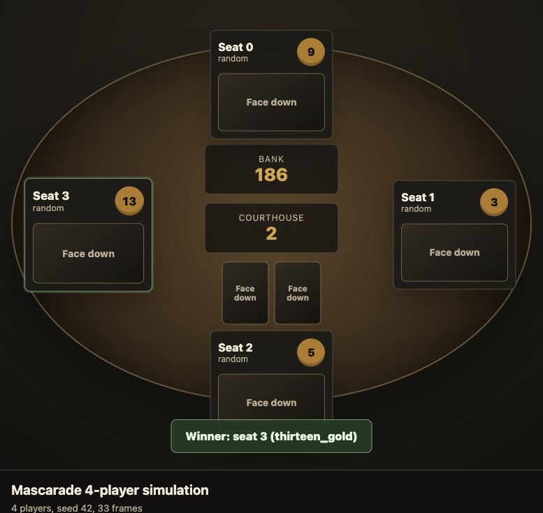

# Mascarade Simulator

This repository starts from the imported Codex project brief in
`docs/mascarade_simulator_codex_plan.md`.

The first implementation is intentionally small:

- a deterministic rules engine for regular 4 to 13 player Mascarade;
- dynamic ontology/config loading from editable JSON;
- a power registry so character behavior can be added as small skills;
- a random bot and CLI for smoke-running games;
- focused tests for challenge resolution, character powers, setup, and end states.



## Quick Start

```bash
PYTHONPATH=src python3 -m unittest discover -s tests
PYTHONPATH=src python3 -m mascarade_sim single --players 6 --seed 1 --verbose
PYTHONPATH=src python3 -m mascarade_sim run --players 6 --games 1000 --seed 42
```

Or use the repo shortcuts:

```bash
make test
make single
make simulate
make experiment
make visualize
```

`make visualize` writes a standalone animated HTML replay to
`visualizations/game_4p_seed42.html`.

## Ontology

The dynamic project knowledge lives in `config/ontology.json`. It defines:

- character schemas and constraints;
- setup profiles by player count;
- action and event schemas;
- skill bindings from character names to Python power handlers.

The engine validates the ontology at load time and dispatches character powers
through the registry in `mascarade_sim.characters`.

## Rulebook Source

The basic 4 to 13 player configuration table has been transcribed from the
uploaded Repos rulebook photo into `docs/rulebook_transcription.md` and locked
with tests. In `config/ontology.json`, each setup's `characters` list is the
full setup deck. For 4 and 5 players, cards beyond the player count are dealt
to middle-table positions.

The 2 and 3 player expert variants are documented in the uploaded rulebook
photos but are not implemented in the engine yet.
